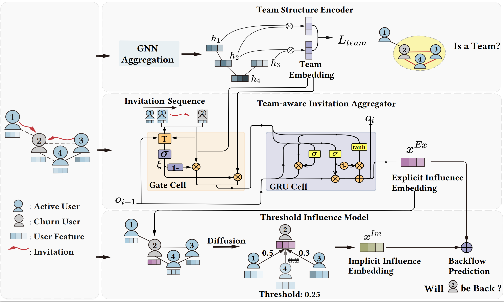
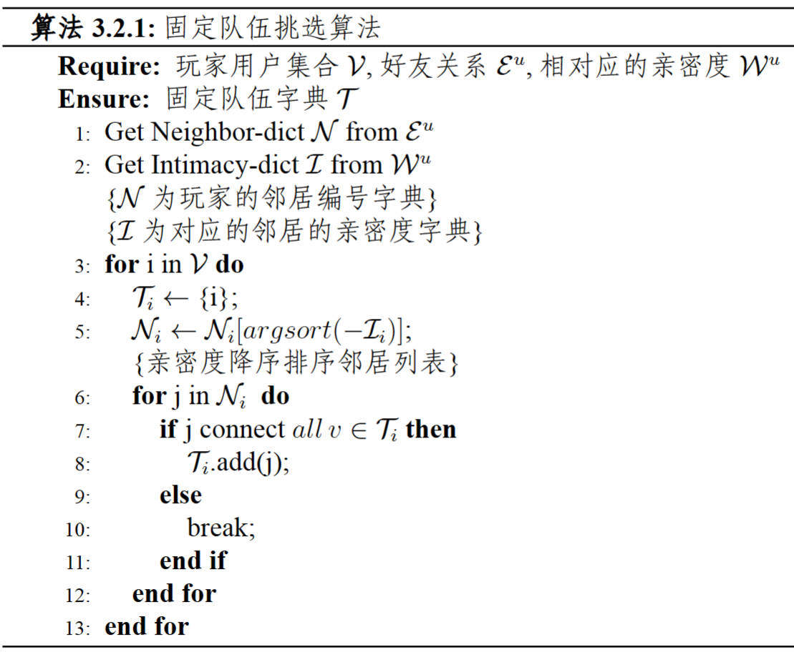

# Who’ll be Back? Backflow Prediction via Community Influence in Mobile Games

## CoInfNet

CoInfNet finds the team structure with a team structure prediction task, and then aggregates the
explicit invitation information with community influence. Finally, the influence diffusion process is modeled via a threshold mechanism.




## Data Input

The dataset which run for the experiments  is saved in `'load_path'`. 

The dataset includes as following.

- `x.npy`:  node features, the first dim represents offline days of each users,
- `y.npy`:  node labels,
- `edge_index_weight.npy`: [3, num_edges],
- `labeled_invitations_data.npy`: [4, num_invitations], each row includes 'inviter_index', 'invitee_index', 'invite_timestamp', 'invitation_label'. The invitation_label represents whether this invitation was sent by the invitee's team members.


`sub_graph`  is an example as the input dataset.


## Team Selectors



### team selectors.py: 

Select team members for each users.

- `Data input`: edge_index_weight.npy
- `Data output`: team_dict.npy  (key: user id, values: corresponding team members ids )


## Model Usage

```latex
python main.py --load_path='subgraph' 
```

